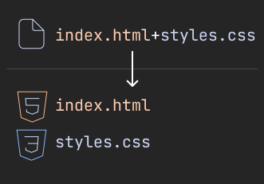
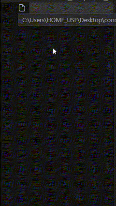
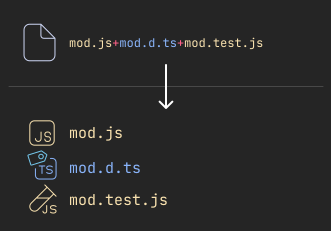
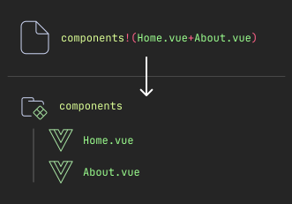
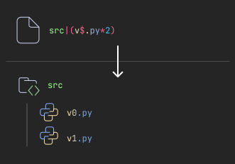

# Emmet File

    
    <h3 style="margin:0;padding:0">A powerful way to setup project scaffolds.</h3>
    
Using Familiar Emmet syntax.

## Features

Emmet File is a extension to scaffold different file & folder structure with [Emmet-style syntax](https://emmet.io/).

From creating multiple files at once.

To a whole project scaffolding

## How to use?
Call the `Track Files` in the Command Pallete (`Ctrl+Shift+P`).

## Grammar

<h3 style="margin:0;padding:0;">
    + 
    Sibling Files
</h3>

Create multiple sibling files using `+`, try `index.html+styles.css`!

<h3 style="margin:0;padding:0;">
    ! 
    Directory
</h3>

Create Directories with `!`, as `dirname!file`.

<h3 style="margin:0;padding:0;">
    ^ 
    Repitition,
    $ 
    Number
</h3>

Same as Emmet, but replace `*` with `^`
